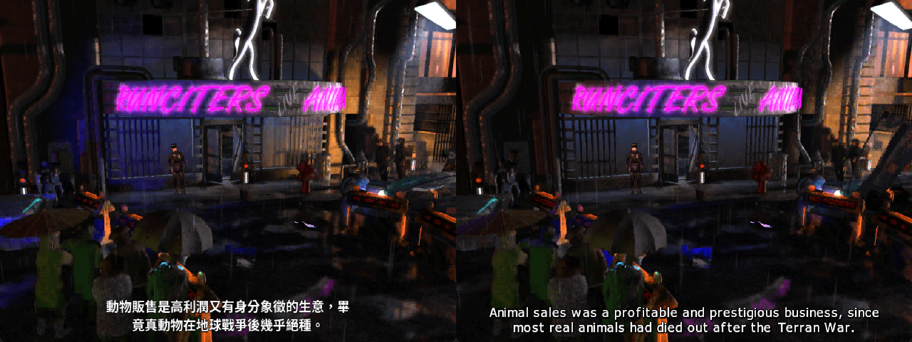
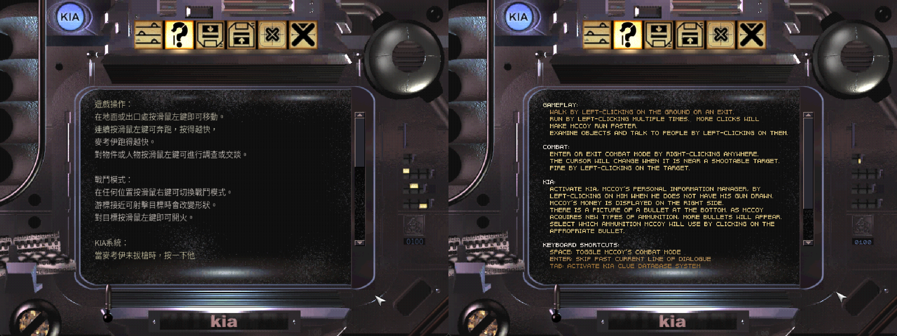
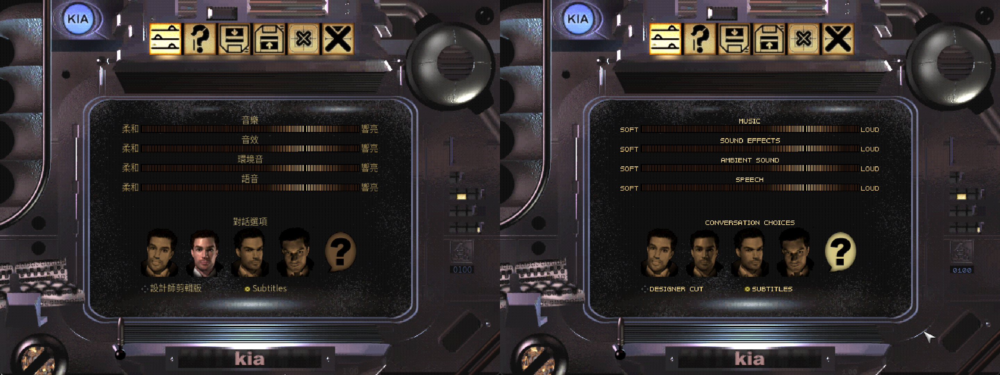
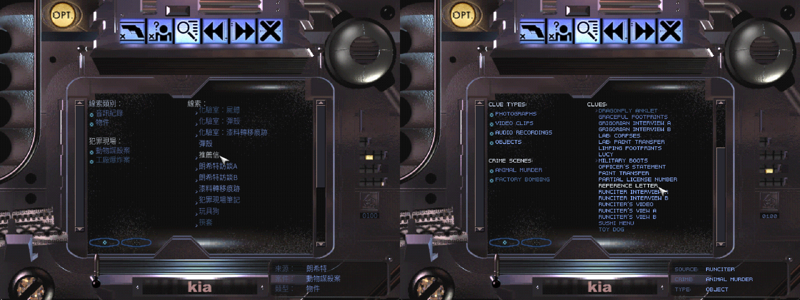
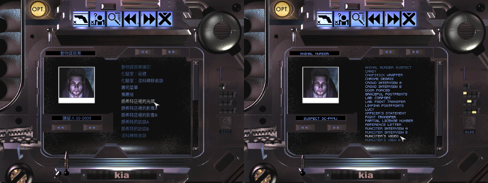
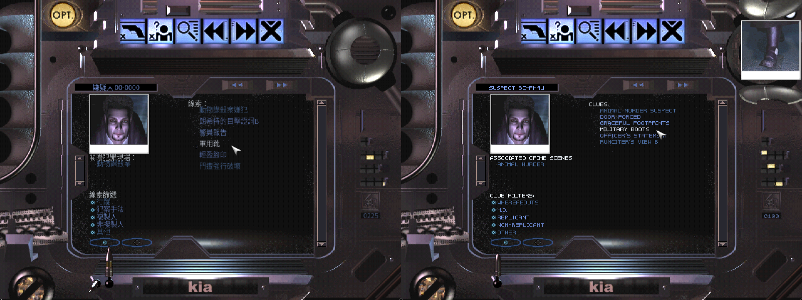
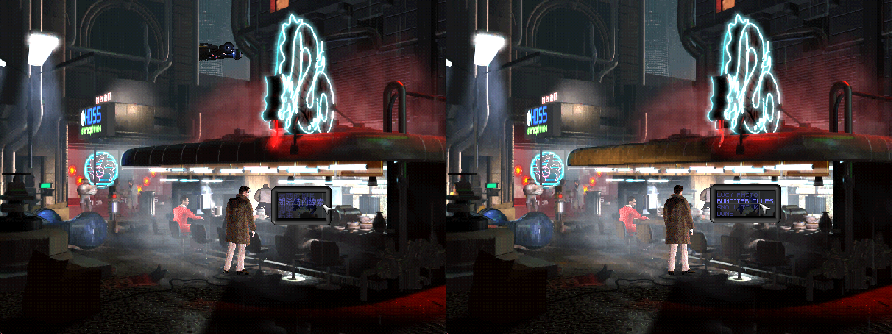

# Blade Runner 銀翼殺手正體中文化 (ScummVM引擎)


## 概述

本中文化是基於 ScummVM 的 Blade Runner 引擎，增加正體中文（台灣）支援，包含：
- 遊戲介面全面 TTF 字型支援（取代原始點陣字型）
- UI中文字顯示（KIA 資料庫、線索、嫌犯、設定等所有頁面）
- 遊戲內對話選項選單中文化
- 遊戲對話字幕中文化工具
- $\color{red}{中文化不含遊戲原始檔}$

先說在前，中文化可以分兩個階段，字幕中文化及介面中文化。

---

## 中文化相關檔案

```
├── src/                             ← 覆蓋ScummVM程式碼
│   ├── engines/bladerunner/
│   │   ├── bladerunner.h            ← kUIFontSize, kUIFontYOffset
│   │   ├── bladerunner.cpp          ← 三層字型載入 + ZH 語系碼
│   │   ├── text_resource.h/.cpp     ← getTextU32()
│   │   ├── crimes_database.h/.cpp   ← getClueTextU32()
│   │   ├── subtitles.h
│   │   ├── dialogue_menu.h/.cpp     ← 對話選單 U32String + 動態行高
│   │   └── ui/
│   │       ├── ui_scroll_box.h/.cpp ← 動態行高 + lineHeightOverride
│   │       ├── ui_image_picker.h/.cpp← Tooltip U32String
│   │       ├── kia_section_*.cpp    ← 各介面頁面中文渲染
│   │       └── ...
│   └── graphics/fonts/
│       ├── ttf.h                    ← yOffsetAdjust 參數
│       └── ttf.cpp
│
├── tools/                           ← 翻譯工具 字幕解包/打包
│   └── br_subtitle_tool.py          ← dump / import / patch-tlk
│
├── subtitles_translated_zhTW.xlsx   ← 已翻譯字幕中英對照參考檔
└── ui_text_translated_zhTW.xlsx     ← 已翻譯介面中英對照參考檔
```

## 字幕中文化
1997年銀翼殺手為了體現整部遊戲像互動式電影一樣，所有的對話都沒有對話框，ScummVM在2.1版本引進銀翼殺手引擎，不用再擔心Windows版本直接就能執行該遊戲，除了修掉一些BUG外還補齊了這個缺憾，就是原版遊戲沒有的字幕，中文化這個字幕檔在不用修改任何程式下，幾乎可以完全在ScummVM官網下載的版本能直接使用。


---

## 介面中文化
再來進一步是介面的中文化，目前尚未跟ScummVM團隊溝通前，只能以分支的方式獨立出執行檔，雖然是Windows下的遊戲，但仍然用點陣英文字型，所以要中文化就得改掉，改成能支援TTF的字型，不得已就得動到程式，以下就是修改的檔案清單︰

### 1. `graphics/fonts/ttf.h` / `ttf.cpp`
**功能**：在 `loadTTFFont()` 加入全域垂直偏移參數

- 新增 `int yOffsetAdjust = 0` 可選參數（預設 0，完全向後相容）
- 傳入負值可讓所有字形往上移，修正字型 metrics 造成的視覺偏低問題
- 僅 BladeRunner 引擎使用非 0 值，其他所有引擎呼叫完全不受影響

**注意**：這是 ScummVM 共用元件的修改，不影響其他引擎行為

---

### 2. `engines/bladerunner/bladerunner.h`
**功能**：新增 UI 字型大小與垂直偏移常數

- `kUIFontSize = 16`：UI TTF 字型大小（pt），在 72dpi 下 1pt = 1px，調整此數字即可改變全部 UI 文字大小
- `kUIFontYOffset = -5`：所有字形的垂直偏移修正（負數往上移），用於修正 FreeType 字型在 `kTTFSizeModeCell` 模式下視覺偏低的問題（此數值需依使用字型微調，預設使用Source Han Sans TC Light，偏移設定-5）

**注意**：原本的 `kMainFontTTFSize = 12` 已更名為 `kUIFontSize = 16`，並在 `loadTTFFont()` 加入明確的 `72, 72` dpi 參數，確保數值直觀對應像素高度。

---

### 3. `engines/bladerunner/bladerunner.cpp`
**功能**：實作三層 UI 字型載入機制

載入順序（優先度遞減）：
1. **`UIFONT.TTF`**（優先）：從 `SUBTITLES.MIX` 或遊戲目錄讀取，介面專用字型
2. **字幕 TTF**（次選）：共用 `SUBFONT.TTF` 的字型（`SBTLVERS.TRE` 宣告的字型）
3. **`KIA6PT.FON`**（最後備援）：原始內建點陣字型

**注意**：`UIFONT.TTF` 使用固定檔名，由 `br_subtitle_tool.py import` 打包進 `SUBTITLES.MIX`

---

### 4. `engines/bladerunner/text_resource.h` / `text_resource.cpp`
**功能**：新增 UTF-8 → U32String 解碼方法

- `getTextU32(uint32 id)`：將 UTF-8 字串正確解碼為 `Common::U32String`
- `getOuttakeTextU32ByFrame(uint32 frame)`：VQA 過場動畫字幕用

**原因**：`Common::String` 以單位元組迭代，CJK 多位元組字元（UTF-8）會被拆成亂碼傳給 `drawChar`，必須用 `U32String` 才能正確渲染

---

### 5. `engines/bladerunner/crimes_database.h` / `crimes_database.cpp`
**功能**：新增線索名稱的 U32String 取得方法

- `getClueTextU32(int clueId)`：回傳 `Common::U32String` 格式的線索名稱

---

### 6. `engines/bladerunner/ui/ui_scroll_box.h` / `ui_scroll_box.cpp`
**功能**：動態行高 + 可覆寫行高機制

- 移除 `static const int kLineHeight = 10`，改為執行期動態計算 `_lineHeight`
- Lazy initialization：在 `show()` 被呼叫時才計算（確保字型已載入）
- 計算公式：`_lineHeight = getMainFont()->getFontHeight() + 2`，最小值 10
- 新增 `lineHeightOverride` 建構子參數（預設 0 = 自動），傳入正整數可強制指定行高
- Checkbox 和高亮 icon 垂直置中（`_lineHeight - shape->getHeight()) / 2`）
- 滑鼠點擊判定（`handleMouseMove`）改用 `_lineHeight`

**目前實際套用的行高覆寫值**：
| 位置 | 檔案 | 數值 |
|---|---|---|
| 線索資料庫 — 線索類別/犯罪現場（左） | `kia_section_clues.cpp` `_filterScrollBox` | 14 |
| 線索資料庫 — 線索清單（右） | `kia_section_clues.cpp` `_cluesScrollBox` | 14 |
| 案件資料庫 — 線索清單（右） | `kia_section_crimes.cpp` `_cluesScrollBox` | 14 |
| 嫌犯資料庫 — 關聯犯罪現場（左） | `kia_section_suspects.cpp` `_crimesScrollBox` | 12 |
| 嫌犯資料庫 — 線索清單（右） | `kia_section_suspects.cpp` `_cluesScrollBox` | 14 |

要調整這些位置的行距，只需修改對應建構子最後一個參數的數字，重新 build 即可，不影響其他清單。

---

### 7. `engines/bladerunner/ui/ui_image_picker.h` / `ui_image_picker.cpp`
**功能**：Tooltip 改用 U32String

- `Image::tooltip` 從 `Common::String` 改為 `Common::U32String`
- `defineImage()` 和 `setImageTooltip()` 在存入時自動 UTF-8 解碼
- `drawTooltip()` 直接用 `U32String` 呼叫 `drawString`，正確渲染 CJK 字元
- `drawTooltip()` 的文字 y 座標改為 `rect.top - BladeRunnerEngine::kUIFontYOffset`，自動補償全域字形偏移，避免 tooltip 文字跑出框外

---

### 8. `engines/bladerunner/ui/kia_section_help.cpp`
**功能**：HELP 頁面改用 U32String

- `getText(i)` 改為 `getTextU32(i)`，並用 `U32String` overload 的 `addLine()`


---

### 9. `engines/bladerunner/ui/kia_section_settings.cpp`
**功能**：設定頁面所有文字改用 U32String

- 所有 `const char *textXxx = getText(N)` 改為 `Common::U32String textXxx = getTextU32(N)`
- 空字串判斷：`strcmp(getText(N), "") == 0` 改為 `getText(N)[0] == '\0'`


---

### 10. `engines/bladerunner/ui/kia_section_clues.cpp`
**功能**：線索資料庫介面中文支援 + filterScrollBox 行高

- 所有 `drawString` 改用 `getTextU32()` 和 `U32String`
- `assetTypeNames[]` 改為 `Common::U32String[]`
- `addLine` 改用 `getTextU32()` 和 `getClueTextU32()`
- `_filterScrollBox` 建構子加 `lineHeightOverride=10`（shape 9px + 1px，可調整）


---

### 11. `engines/bladerunner/ui/kia_section_crimes.cpp`
**功能**：罪案資料庫介面中文支援

- `draw()` 裡 `const char *text` 改為 `Common::U32String text`
- `String::format` 拼接改為 `U32String` 相加
- `addLine` 改用 `getClueTextU32()`


---

### 12. `engines/bladerunner/ui/kia_section_suspects.cpp`
**功能**：嫌犯資料庫介面中文支援 + 線索篩選行高

- `draw()` 裡所有文字改用 `getTextU32()` 和 `U32String`
- `_crimesScrollBox` 加 `lineHeightOverride=10`
- 線索篩選 checkbox（`UICheckBox`）座標重新計算，間距 `kFilterItemSpacingSuspects = 12`（原 10）
- `addLine` 改用 `getClueTextU32()`


---

### 13. `engines/bladerunner/ui/kia_section_diagnostic.cpp`
**功能**：片尾捲動字幕改用 U32String

---

### 14. `engines/bladerunner/ui/kia_section_save.cpp`
**功能**：存檔選單文字改用 U32String

---

### 15. `engines/bladerunner/dialogue_menu.h` / `dialogue_menu.cpp`
**功能**：對話選項選單支援中文 + 動態行高

- `DialogueItem::text` 從 `Common::String` 改為 `Common::U32String`
- `addToList()` 改用 `getTextU32()` 取得文字
- `_lineHeight` 在 `showAt()` 時從 `_shapes->get(1)->getHeight()` 取得（與邊框 shape 齊平，避免行距空隙）
- `kLineHeightExtra`：額外行高常數（預設 0），增加可讓行距稍寬，並自動用 `darkenRect` 填補 shape 未覆蓋的區域


---

## 翻譯工具 `tools/br_subtitle_tool.py`
**功能**：字幕與 UI 翻譯一站式工具
- 安裝Python3.xx
- `pip install openpyxl`

#### 三個指令：

**`dump --dir 遊戲目錄 --out 輸出目錄`**
- 掃描解包檔案 `SUBTITLES.MIX`（字幕）與 `1.TLK`/`2.TLK`/`3.TLK`/`A.TLK`（UI 文字）
- 輸出兩個翻譯檔 `subtitles.xlsx`（字幕翻譯）和 `ui_text.xlsx`（介面翻譯）

**`import --subxlsx 字幕xlsx --uixlsx 介面xlsx --out 輸出目錄 [--font-dir 字型目錄]`**
- 讀入兩個 Excel 翻譯檔進行檔案打包
- 自動偵測 `SUBFONT.TTF`（字幕字型）和 `UIFONT.TTF`（介面字型）
- 輸出 `SUBTITLES.MIX`（含翻譯、字型、SBTLVERS.TRE）和零散 `.TRE` 檔案

**`patch-tlk --dir 遊戲目錄 --xlsx 介面xlsx`**
- 直接把 UI 翻譯寫回 TLK 資源檔案內
- 自動備份為 `.bak`，可隨時還原

#### 涵蓋的 UI TRE 資源檔：
| 資源檔名稱 | 內容 |
|----------|------|
| KIA.TRE | KIA 介面標籤、按鈕 tooltip |
| HELP.TRE | KIA 說明頁面 |
| OPTIONS.TRE | 設定選單 |
| SPINDEST.TRE | 飛行車目的地 |
| VK.TRE | VK測試介面 |
| ACTORS.TRE | 角色名稱 |
| CRIMES.TRE | 案件名稱 |
| CLUETYPE.TRE | 線索類型標籤 |
| CLUES.TRE | 線索名稱 |
| DLGMENU.TRE | 遊戲內對話選項 |

---

## 字型設定

### 字幕字型（SUBFONT.TTF）
- 放在工具目錄，將TTF字型檔改檔名為`SUBFONT.TTF`
- `import` 指令自動打包進 `SUBTITLES.MIX`（檔名為 `SUBFONT.TTF`才會包入）
- 建議使用支援正體中文的字型，預打包的是 Source Han Sans TC Bold

### 介面字型（UIFONT.TTF）
- 放在工具目錄，將TTF字型檔改檔名為`UIFONT.TTF`
- `import` 指令自動打包進 `SUBTITLES.MIX`（檔名為 `UIFONT.TTF`才會包入）
- 引擎優先讀取此字型作為 UI 字型
- 字型大小由 `bladerunner.h` 的 `kUIFontSize` 控制（目前 = 16）
- 垂直偏移由 `kUIFontYOffset` 控制（目前 = -5）
- 建議使用支援正體中文的字型，預打包的是 Source Han Sans TC Light

---

## 名詞翻譯對照

### 特殊名詞
| English Name                    | 中文譯名           |
| ------------------------------- | -------------- |
| Blade Runner                    | 銀翼殺手    |
| Chinyen                         | 信圓 (貨幣) |
| Incept Photo/File               | 記憶植入的照片/檔案  |
| Implant                         | 植入記憶       |
| Nexus-6                         | Nexus六型    |
| Off-World                       | 世外殖民地   |
| Replicants                      | 複製人     |
| Retirement                      | 退役       |
| Skin-Jobs                       | 假皮鬼    |
| Spinner                         | 飛行車     |
| Voigt-Kampff                    | VK測試儀    |

### 角色姓名
**除了第一行主角名字外，其他分有無全名及英文字母排序**
| English Name                    | 中文譯名           |
| ------------------------------- | -------------- |
| Ray McCoy                       | 雷．麥考伊 (主角)     |
| Abdul Hasan                     | 阿布杜爾．哈桑         |
| Bob Gorsky (Bullet Bob)         | 鮑伯・葛斯基 (子彈鮑伯)  |
| Crystal Steele                  | 克莉絲朵・史提爾       |
| Edison Guzza (Lieutenant Guzza) | 艾迪生．古薩 (古薩中隊長) |
| Eldon Tyrell                    | 艾爾登．泰瑞爾        |
| Gordo Frizz                     | 戈多．弗力茲         |
| Hannibal Chew                   | 漢尼拔・周 (老周)    |
| Harry Bryant                    | 哈利．布萊恩         |
| Howie Lee                       | 豪伊．李           |
| Jack Walls (Sergeant Walls)     | 傑克．華爾斯 (華爾斯警佐) |
| J.F. Sebastian                  | J.F. 賽巴斯汀       |
| Larry Hirsch (Crazylegs)        | 賴瑞．赫許 (瘋腿)     |
| Lucy Devlin                     | 露西・戴夫林         |
| Maurice Kolvig (Governor)       | 墨利斯・柯維 (總督)    |
| Spencer Grigorian               | 史賓塞・葛高里安       |
| Taffy Lewis                     | 塔菲・劉易斯        |
| Baker                           | 貝克             |
| Clovis                          | 克洛維斯           |
| Dektora                         | 黛克朵拉           |
| Early Q                         | 厄利Q            |
| Eisenduller                     | 艾森杜勒         |
| Gaff                            | 蓋夫             |
| Hanoi                           | 河內             |
| Holloway                        | 哈洛威            |
| Isabella                        | 伊莎貝拉           |
| Izo                             | 伊佐             |
| Klein                           | 克萊因            |
| Lance                           | 藍斯             |
| Leon                            | 里昂             |
| Luther                          | 路瑟             |
| Maggie                          | 瑪姬             |
| Marcus                          | 馬可仕            |
| Mia                             | 米亞             |
| Moraji                          | 莫拉吉            |
| Murray                          | 莫瑞             |
| Rachael                         | 瑞秋             |
| Rajif                           | 拉吉夫            |
| Runciter                        | 朗希特            |
| Sadik                           | 薩迪克            |
| Zuben                           | 祖本             |

### 場景名稱
| English Name                    | 中文譯名           |
| ------------------------------- | -------------- |
| Animoid Row                     | 仿生街 |
| Bullet Bob’s                    | 子彈鮑伯槍店     |
| Bradbury Building               | 布萊伯利大樓 |
| China Bar                       | 唐人酒吧         |
| Chinatown                       | 唐人街          |
| Chew's Eyeworks                 | 眼球工作室 |
| Dermo Design                    | 德莫設計公司 |
| DNA Row                         | DNA街 |
| Early Q's                       | 厄利Q夜店 |
| Grav Test Lab                   | 重力測試實驗室 |
| Hawker’s Circle                 | 霍克商圈        |
| Howie Lee’s Restaurant          | 豪伊李餐館       |
| Hysteria Hall                   | 歇斯底里遊藝館 |
| Kingston Kitchen                | 金斯頓廚房       |
| Kipple                          | 垃圾荒原 |
| McCoy's Apartment               | 麥考伊的公寓     |
| Nightclub Row                   | 夜店街 |
| Police Station                  | 警察局          |
| Runciter's Animals              | 朗希特動物店     |
| Tyrell Building                 | 泰瑞爾大樓 |
| Tyrell Pyramids                 | 泰瑞爾金字塔 |
| Yukon Hotel                     | 育空旅社         |


---

## 語系碼設定（重要）

`bladerunner.cpp` 的語言代碼 switch 需要加入中文的 case：

```cpp
case Common::ZH_TWN:
case Common::ZH_CHN:
    _languageCode = "C";
    break;
```

**影響**：在ScummVM主程式修改語系設定前這些功能都是預定，目前是沒有作用。未來能設定 `language=zh`，參數 `localized=true` 的 TRE 資源會找 `.TRC` 副檔名而非 `.TRE`。工具的 `patch-tlk` 指令直接改寫 TLK 內的 hash，不受此影響。若使用散落檔案方式，需確認副檔名對應語言碼。

---

## Build 環境

- 安裝MSYS2開發工具，並執行MSYS2 UCRT64

上述src中的檔案可覆蓋ScummVM程式碼，或是直接複製 fork 的 ScummVM進行編譯：
👉 https://github.com/lightgreentw/scummvm （分支：`zh-tw-bladerunner`）
- `git clone -b zh-tw-bladerunner https://github.com/lightgreentw/scummvm.git`

### 一般編譯
- `./configure --disable-all-engines --enable-engine=bladerunner --enable-freetype2`
- `make -j$(nproc)`

**注意**：不要加 `--enable-plugins`（會造成動態插件錯誤）

### 縮小編譯體積
- `LDFLAGS="-static -lharfbuzz -lbrotlidec -lbrotlicommon -lbz2 -lpng16 -lz" \
./configure \
  --disable-all-engines \
  --enable-engine=bladerunner \
  --enable-freetype2 \
  --disable-debug \
  --enable-static`
- `echo "LIBS += \$(shell pkg-config --static --libs freetype2 sdl2)" >> config.mk`
- `make -j$(nproc)`
- `strip scummvm.exe`

---

## 已知問題

1. VQA 過場動畫字幕需要 `SUBTITLES.MIX` 裡的 VQA TRE 資源
2. Fribidi 警告（`initWithU32String: Fribidi not available`）對中文無影響，可忽略
3. `EXTRA.TRE` 找不到的警告為正常，此資源非必要
4. 對話選單（DialogueMenu）的邊框 shape 高度固定（9px），透過 `kLineHeightExtra` 調整行距高於9px，邊框有間隔，目前還是先用9px，缺點是行距很擠。
5. ScummVM 2026.3.1版本中文字變醜，每個字多了一個黑色外框，目前還找不到原因。

### ScummVM 2026.3.1版編譯問題
`BladeRunnerEngine` 有兩個字型欄位：
- `_mainFont`（`BladeRunner::Font*`，舊式點陣字型）
- `_mainFontTTF`（`Graphics::Font*`，新的 TTF 字型）

`getMainFont()` 函式會依 `_mainFontIsTTF` 自動回傳正確的那一個。**但引擎裡有多處程式碼繞過 `getMainFont()`，直接呼叫裸指標 `_vm->_mainFont->`**。

TTF 模式啟用時，`_mainFont` 會被明確設為 `nullptr`（因為改用 `_mainFontTTF`）。任何直接呼叫 `_vm->_mainFont->drawString(...)` 的地方，在 TTF 模式下就是對 `nullptr` 呼叫成員函式，直接閃退。

英文（點陣）模式因為 `_mainFont` 剛好是有效指標，這些地方「碰巧」不會出事，因此問題在純英文測試時完全隱形。

#### 受影響的檔案（全部需要把 `_vm->_mainFont->` 改成 `_vm->getMainFont()->`）
| 檔案 | 觸發時機 |
|---|---|
| `ui/kia.cpp` | 每次進入 KIA、每一幀（Chinyen 金額、版本號顯示）|
| `ui/ui_dropdown.cpp` | 開啟任何下拉選單（如設定裡的語言選擇）|
| `ui/ui_input_box.cpp` | 存檔輸入文字框 |
| `ui/esper.cpp` | 使用 ESPER 照片分析機 |
| `subtitles.cpp` | 特定字幕疊加畫面 |
| `debugger.cpp` | 開啟除錯主控台疊加畫面 |

**如果你是從舊版分支重新合併這份修改包，務必先搜尋整個 `engines/bladerunner/` 目錄確認沒有殘留 `_vm->_mainFont->` 裸指標呼叫：**
```bash
grep -rn "_vm->_mainFont->" engines/bladerunner/
```
正常情況下這行指令應該完全沒有輸出。


---

## Reference

- Blade Runner developed by Westwood Studios
- ScummVM/bladerunner engine by the ScummVM team
- claude.ai
- 銀翼殺手電影藍光 華納進口
- 銀翼殺手遊戲光碟 第三波資訊代理出版
- 銀翼殺手攻略集中文版 第三波資訊代理出版

